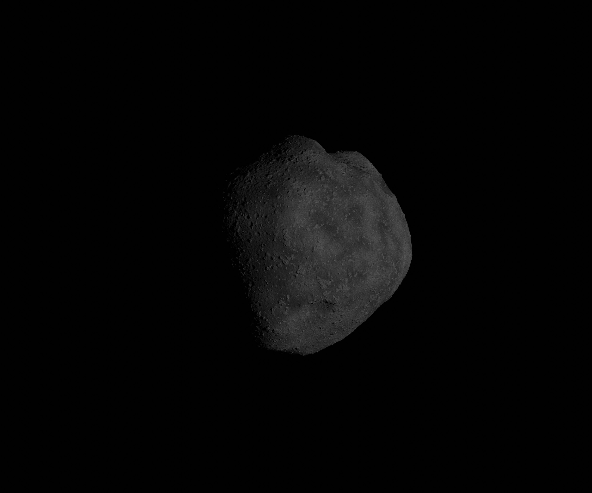

.. SPDX-FileCopyrightText: 2021 Gabriel J. Schwarzkopf <sispo-devs@outlook.com>
..
.. SPDX-License-Identifier: GFDL-1.3-or-later

.. SISPO documentation master file, created by
   sphinx-quickstart on Sun Mar  1 14:16:26 2020.
   You can adapt this file completely to your liking, but it should at least
   contain the root `toctree` directive.

Welcome to SISPO's documentation!
=================================
.. mdinclude:: ../../README.md

Example images created by SISPO using the Blender renderer
==========================================================
A final image using the Blender rendering pipeline consists of 4 raw images.

The first image shows the star background.

The second image shows the image which includes only the SSSB.

The third image shows the image with the SSSB at a constant distant.

The fourth image shows the light reference which is needed to compose the final image.

These four images are combined using the compositor module to give the final images below.

Overall python software structure
=================================
.. image:: figs/programme_structure.svg

Figure 1: Overall software structure with main package, sub-packages, modules and sub-modules.

A more detailed definition of classes, methods and attributes can be found under :py:mod:`sispo` and its sub-packages.

SISPO execution flow diagram
============================
.. image:: figs/programme_flow.svg

Figure 2: Software flow diagram showing how functions are executed step by step.

.. image:: figs/programme_flow_sim.svg

Figure 3: Software flow diagram showing how functions are executed step by step during simulation.

.. image:: figs/programme_flow_reconstruct.svg

Figure 4: Software flow diagram showing how functions are executed step by step during reconstruction.

.. toctree::
   :maxdepth: 2
   :caption: Contents:

   modules
   setup

Indices and tables
==================

* :ref:`genindex`
* :ref:`modindex`
* :ref:`search`
