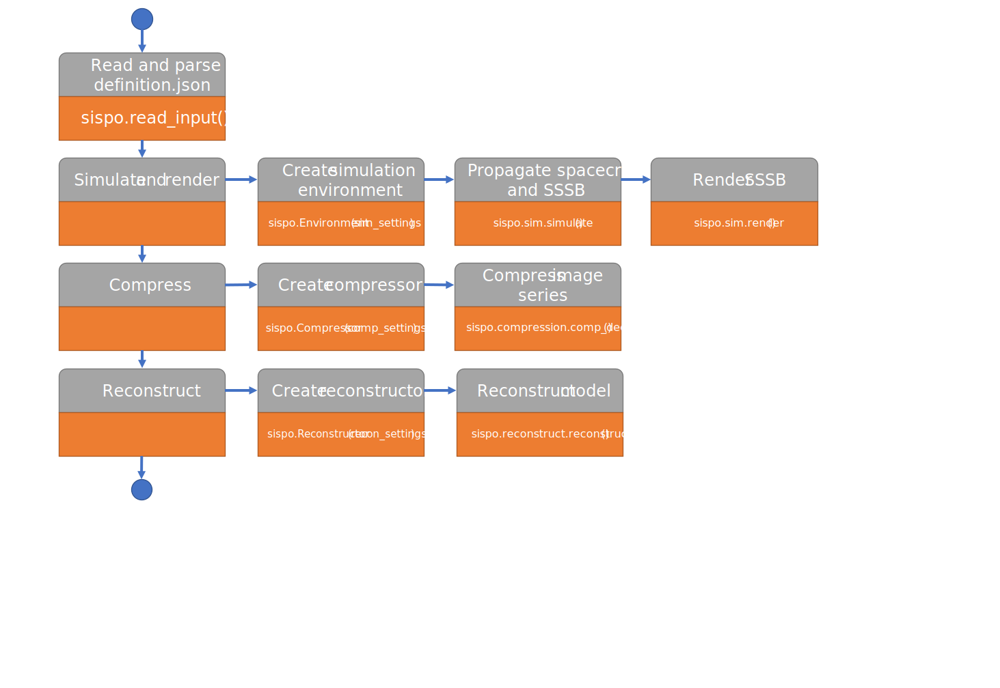

.. SISPO documentation master file, created by
   sphinx-quickstart on Sun Mar  1 14:16:26 2020.
   You can adapt this file completely to your liking, but it should at least
   contain the root `toctree` directive.

Welcome to SISPO's documentation!
=================================
.. mdinclude:: ../../README.md

Overall python software structure
=================================

Figure 1: Overall software structure with main package, sub-packages, modules and sub-modules.

A more detailed definition of classes, methods and attributes can be found under :py:mod:`sispo` and its sub-packages.

SISPO execution flow diagram
============================

Figure 2: Software flow diagram showing how functions are executed step by step.

Figure 3: Software flow diagram showing how functions are executed step by step during simulation.

.. image:: figs/programme_flow_reconstruct.svg

Figure 4: Software flow diagram showing how functions are executed step by step during reconstruction.

.. toctree::
   :maxdepth: 2
   :caption: Contents:

   modules
   setup

Indices and tables
==================

* :ref:`genindex`
* :ref:`modindex`
* :ref:`search`
